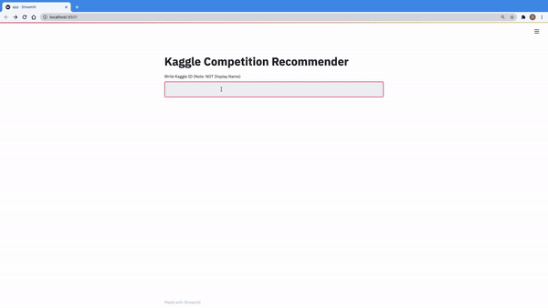

# Kaggle Competition Reccomender



## Recommend algorithm

- Non-Negative Matrix Factorization (NMF) by [sklearn](https://scikit-learn.org/stable/modules/generated/sklearn.decomposition.NMF.html)
- Target values are whether a user participates in a competition.
- You can see full codes in [this published notebook](https://www.kaggle.com/sishihara/competition-recommendation-by-matrix-factorization).

## Environment

```bash
pip install -r requirements.txt
streamlit run kaggler-ja-faq/kaggler-ja-faq.py
```

If you just want to see the recommended lists of your own, you can copy and edit the published notebook. All you have to do is to edit `user_name` in In [7].

## Data

You can download files to be placed in `data` folder.

https://www.kaggle.com/sishihara/competition-recommendation-by-matrix-factorization
